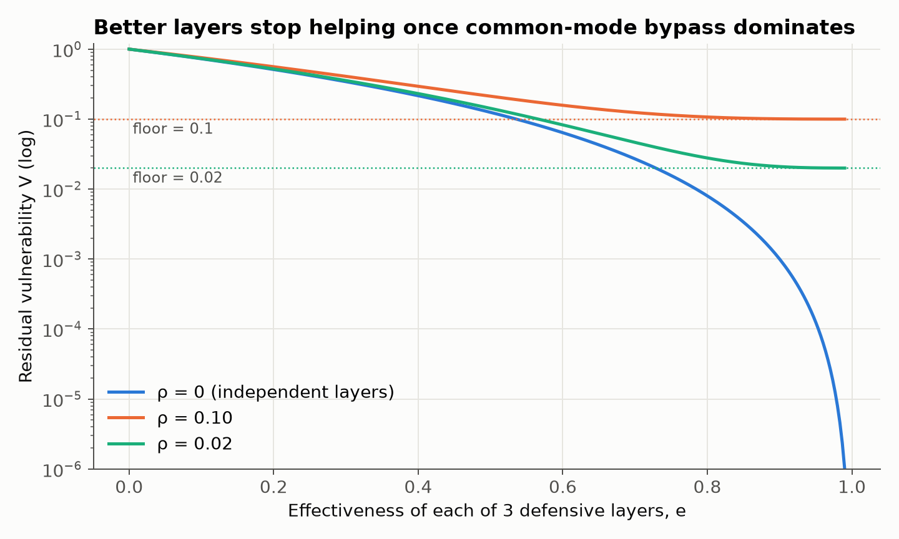
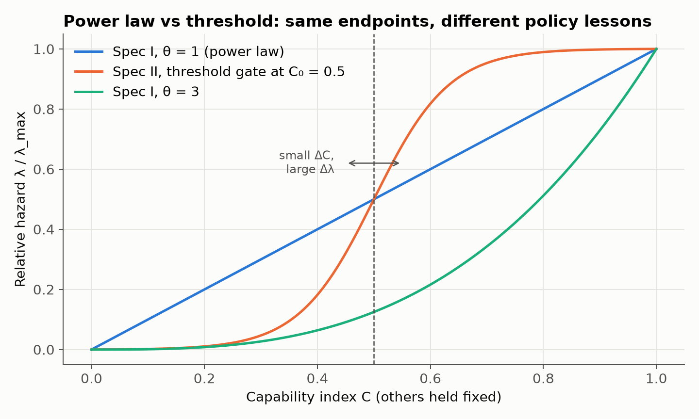
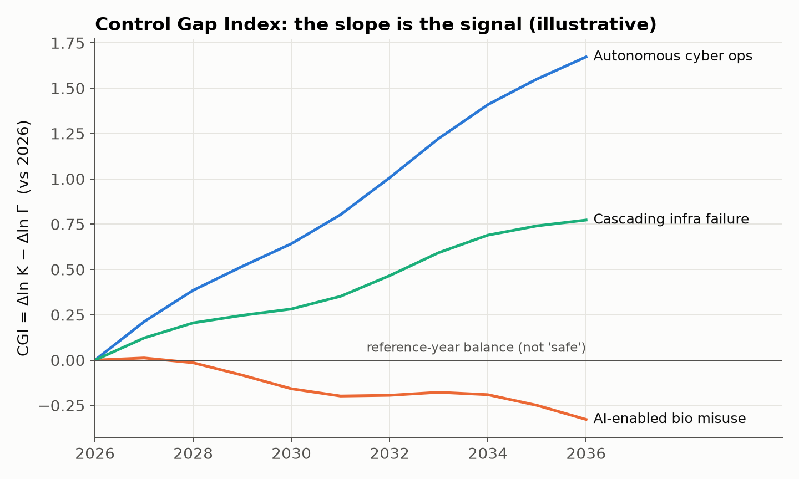
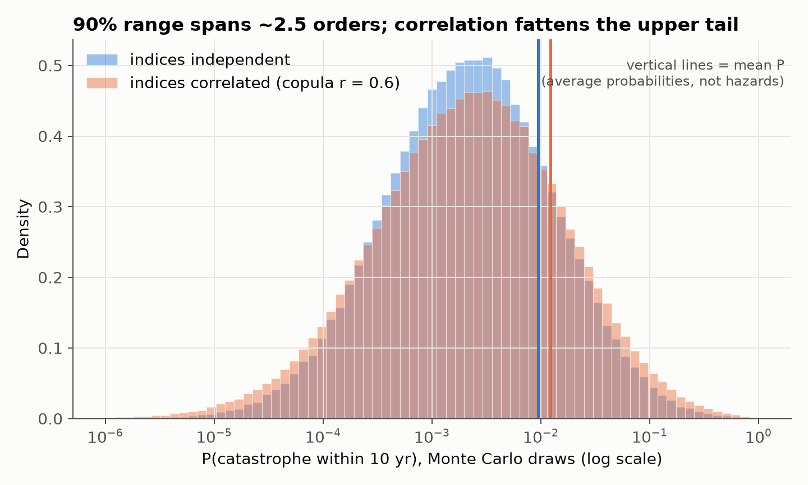
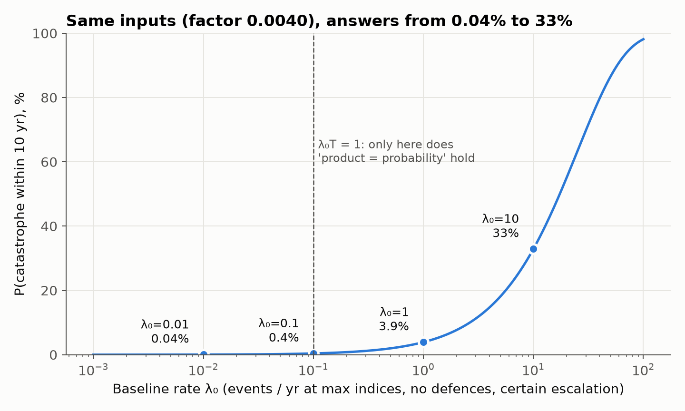

# The AI Drake Equation

## When does AI capability become consequential power?

**Veselin Pizurica** · Draft v4 · September 2026 · Licensed under [CC BY 4.0](https://creativecommons.org/licenses/by/4.0/)

*Every model in this paper is explorable at [controlgap.streamlit.app](https://controlgap.streamlit.app), and implemented in [github.com/pizuricv/controlgap](https://github.com/pizuricv/controlgap).*

---

### Abstract

The Drake equation did not tell us how many civilisations exist. It turned an unanswerable question into a set of questions that could be answered one at a time. This paper applies the same idea to catastrophic AI risk.

Instead of a headline probability detached from its reasoning, we ask what must coincide for an AI system to contribute to an irreversible catastrophe. Our thesis is that **capability alone does not determine catastrophic risk**. Risk emerges when capability becomes *consequential power*: capability that is accessible, able to act, and connected to systems that matter, and that is not stopped by the layers of control and recovery around it.

We propose a measurement architecture built on one scenario-specific hazard model, which we read in two ways.

1. **As a probability.** Catastrophe pathways are treated as competing risks. Each has a rate built from four parts:
   - the number of deployment episodes;
   - capability, access, agency, exposure and propensity indices;
   - a residual vulnerability derived from layered, possibly correlated defences;
   - an irreversibility term derived from a race between escalation and recovery.
2. **As a trend.** The **Control Gap Index** is the log hazard ratio relative to a reference year. In it, the least identifiable parameter cancels exactly. It therefore measures whether consequential capability is growing faster than control, without requiring anyone to know the absolute probability.

We show that absolute catastrophe probabilities are not currently identifiable: for fixed, plausible inputs they range from 0.04% to 33%. We identify precursor data as the only realistic route to calibration, and show which quantities can already be tracked.

---

## 1. The problem with headline numbers

Suppose someone says the probability of AI catastrophe is 2%. What does that number assume?

- Does it assume future systems become extremely capable?
- That they are autonomous?
- That they are connected to critical infrastructure?
- That human oversight fails?
- That the outcome cannot be reversed?

Different answers produce radically different numbers.

The best existing estimates do expose their structure. Carlsmith's report on power-seeking AI is an explicit chain of conditional premises. The problem is the number that travels without its decomposition. A single figure quoted without its assumptions cannot be argued with, updated or acted upon.

A useful framework should keep the assumptions attached to the number. Each factor should be something that evidence could, in principle, move.

## 2. Thesis

> **AI capability becomes dangerous when it becomes consequential power: capability that can be accessed, exercised and connected to the real world, faster than we can detect, stop, contain and recover from its failures.**

This gives the paper its spine. There are two sides:

```text
   CONSEQUENCE SIDE                          CONTROL SIDE
   ────────────────                          ────────────
   Episodes    (ν)                           Detection
   Capability  (C)                           Intervention
   Access      (A)          versus           Containment
   Agency      (O)                           Independence of layers
   Exposure    (X)                           Recovery
   Propensity  (M)
        │                                         │
        ▼                                         ▼
   CONSEQUENTIAL CAPABILITY  K            CONTROL & RESILIENCE  Γ
```

We deliberately avoid calling the left side "offensive." The framework has to cover accidents, emergent behaviour, cascading failures and misuse, not only adversarial intent.

The analogy with Drake is closer than it first appears. Drake's $N = R_* \cdot f_p \cdot n_e \cdot f_l \cdot f_i \cdot f_c \cdot L$ is itself a *rate* multiplied by a chain of fractions and a duration. Our model has the same shape: a baseline rate, multiplied by a chain of indices and conditional probabilities, integrated over a time horizon.

The question worth tracking is not "how intelligent is AI?" but:

> **How much real-world power does AI have relative to our ability to control it, and which of those is growing faster?**

## 3. Related work and contribution

None of the individual ingredients is new.

- **Conjunctive decompositions of AI risk.** Carlsmith (2021; arXiv 2022) decomposes existential risk from power-seeking AI into a chain of conditional premises and multiplies their credences. This is the closest precedent. The present framework differs in three ways:
  - it models a *rate over time*, not a one-shot conjunction;
  - it separates scenarios as competing risks;
  - it makes the control side an explicit, measurable layer rather than one premise among many.
- **Drake-style models under uncertainty.** Sandberg, Drexler and Ord (2018) showed that propagating *distributions* through the Drake equation, rather than multiplying point estimates, changes its conclusion qualitatively. Section 10 takes the same lesson.
- **The multiple-stage fallacy.** Yudkowsky (2016) named a failure mode, illustrated by Silver's (2015) staged estimate of a Trump nomination. Conjunctive chains bias estimates downward when each stage is shaded down independently and correlations between stages are ignored. Any Drake-style model is exposed to this. Section 10 addresses it directly.
- **Probabilistic risk assessment (PRA).** Nuclear safety has decomposed rare, never-observed catastrophes into event trees and fault trees since the Reactor Safety Study (WASH-1400, 1975). After the Lewis review (1978) and Three Mile Island, the NRC established the Accident Sequence Precursor (ASP) programme in 1979. ASP scores observed precursor events by their *conditional core-damage probability*. Our capability → access → agency → exposure → propensity → control-failure chain is an event tree, and our precursor ladder (Section 9) is a direct analogue of ASP. Kaplan and Garrick (1981) supply the underlying definition of risk as a set of (scenario, likelihood, consequence) triplets.
- **PRA for frontier AI.** Koessler and Schuett (2023) review risk-assessment techniques from safety-critical industries for AGI developers. Wisakanto et al. (2025) adapt PRA to AI systems. Our contribution is complementary: a compact hazard specification and a trend index, rather than a full assessment methodology.
- **Barrier models.** Bow-tie analysis and Reason's "Swiss cheese" model (1990) describe layered barriers between a hazard and its consequence. Our residual-vulnerability term is a quantitative bow-tie with correlated holes.
- **Reliability engineering and survival analysis.** We use:
  - hazard rates and competing risks;
  - Cox's (1972) proportional-hazards form;
  - common-cause failure modelling. Fleming's (1975) beta-factor model is the classic reference, though our form differs (Section 6.2).
- **Adaptive adversaries.** Cox (2008) shows why "threat × vulnerability × consequence" fails when the attacker adapts to defences. This objection applies to any multiplicative model with an intelligent adversary, including one where the adversary is the AI system itself. We return to it in Sections 6.2 and 10.
- **Systems safety.** Leveson (2011) and Perrow (1984) argue that linear chain-of-events models miss accidents that emerge from interactions in tightly coupled systems. We take this seriously for our fourth scenario (Section 16).
- **Thresholds in practice.** Frontier-developer safety frameworks, and Koessler, Schuett and Anderljung (2024) on risk thresholds, are threshold models in all but name. Our Specification II (Section 6.5) formalises them.
- **Scenario taxonomies and forecasting.** Relevant work includes:
  - Hendrycks, Mazeika and Woodside (2023) on catastrophic-risk sources;
  - Kasirzadeh (2024) on decisive versus accumulative risk;
  - the Forecasting Research Institute's Existential Risk Persuasion Tournament (Karger et al., 2023), on why disagreements about p(doom) resist resolution.
- **Governance.**
  - The International AI Safety Report 2026 describes loss-of-control scenarios in terms of capability, propensity and a deployment environment that offers opportunity.
  - The EU AI Act classifies general-purpose AI models with systemic risk (Regulation (EU) 2024/1689, Arts. 51–52). It imposes evaluation, adversarial testing, incident reporting and cybersecurity obligations on them (Art. 55).

**Our contribution** is not a new probability distribution. It is a unified measurement architecture that:

- connects AI capability to consequential real-world agency through access, agency, exposure, propensity and episode volume;
- *derives* residual vulnerability from layered, correlated defences, and irreversibility from a race between escalation and recovery;
- lets capability act on the other terms, so that the separability of the policy levers becomes a testable assumption, not a built-in one;
- shows that the Control Gap Index is the identifiable part of the hazard model, namely the log hazard ratio, in which the unknown scale cancels;
- identifies precursor data as the realistic route to calibration, and states the assumption that route requires.

## 4. Scenarios, not "AI catastrophe"

"AI catastrophe" is not one event. Let $s \in \{1,\dots,n\}$ index scenarios, for example:

- autonomous loss of control;
- AI-enabled biological misuse;
- AI-enabled attack on critical infrastructure;
- cascading failure across coupled automated systems.

Define

$$
D_T = \{\text{at least one irreversible catastrophic event occurs in } [0,T]\}.
$$

Each scenario has a cause-specific hazard $\lambda_s(t)$. We require a **partition rule**: every realised event is assigned to exactly one scenario. Given that rule, the total hazard is the sum of the cause-specific hazards. No assumption is needed that the scenarios' latent event times are independent:

$$
\boxed{
P(D_T) = 1 - \exp\!\left[-\int_0^T \sum_s \lambda_s(t)\,dt\right]
}
$$

The hazard formulation brings in time, changing capability, changing deployment and changing defences. It also accounts for the fact that every year of exposure is another opportunity for failure.

Interactions between pathways, such as an autonomous system exploited by a human actor, are modelled as their own scenario $s_{\text{int}}$. The partition rule then prevents them from being double-counted.

## 5. The causal chain, and from episodes to rates

Consider a single **deployment episode** relevant to scenario $s$: one agent run, one model access, one integration exercised. The chain rule of probability gives an *exact* decomposition of the probability that the episode ends in catastrophe:

$$
\pi_s = P(C)\,P(A \mid C)\,P(O \mid C,A)\,P(X \mid C,A,O)\,P(M \mid C,A,O,X)\,P(F \mid C,A,O,X,M)\,P(I \mid F)
$$

where:

- $M$ is the attempt: given the opportunity, the acting agent, human or AI, actually tries the harmful action;
- $F$ is failure of the control layers;
- $I$ is escalation beyond recovery, i.e. irreversibility.

This identity makes no independence assumption. Its value is structural: it tells us which conditional questions must be answered, and in what order.

A probability per episode becomes a rate once we count episodes. If $\nu_s(t)$ is the rate of qualifying episodes (for example, agent runs per year with the relevant permissions), then

$$
\boxed{\lambda_s(t) = \nu_s(t)\,\pi_s(t)}
$$

This matters for identifiability. $\nu_s$ is an operational quantity that can be counted, so only the per-episode probability has to be modelled.

## 6. The hazard model

### 6.1 Two kinds of quantity

The model mixes two kinds of quantity, and it is important to keep them apart.

- **Indices.** $C, A, O, X, M$ are normalised, scenario-specific indices in $[0,1]$, each built from measurable indicators (Section 9). They are *not* probabilities. They are a phenomenological stand-in for the first five conditional terms of the chain.
- **Conditional probabilities.** Residual vulnerability $V$ and irreversibility $p_I$ *are* probabilities. They correspond directly to the last two terms of the chain, $P(F \mid \cdot)$ and $P(I \mid F)$.

| Symbol | Meaning (for scenario $s$) | Example indicators |
|---|---|---|
| $\nu_s$ | Episode rate: qualifying deployment episodes per year | Agent runs with relevant tools; API calls in the relevant domain |
| $C_s$ | Capability: share of the scenario's required capability set demonstrated | Dangerous-capability evaluations, long-horizon task success, oversight-evasion tests |
| $A_s$ | Access: breadth of actors who can obtain that capability | Open-weight availability, API gating, fine-tuning access, compute cost |
| $O_s$ | Agency: ability to act within an episode | Tool access, permissions, persistence, delegation, run length |
| $X_s$ | Exposure: consequential systems reachable in an episode | Integrations with finance, cloud, OT/ICS, labs, communications |
| $M_s$ | Propensity: how readily the acting agent attempts the harmful action, given the opportunity | Autonomous: scheming, sandbagging and oversight-subversion evaluations; alignment stress tests. Misuse: threat intelligence; observed abuse rates per user |

Because $C_s$ is the *share* of a required capability set, capability beyond sufficiency does not register in it. This is deliberate. What matters for a given scenario is whether the capability is present, not how far it exceeds the requirement.

Propensity is the term the International AI Safety Report 2026 places alongside capability and opportunity. Earlier drafts of this paper left it inside the scale constant $\kappa_s$, where progress or regress in alignment could never show up in the trend. Setting $M_s = 1$ is the worst case: the agent always tries.

### 6.2 Residual vulnerability, with correlated failures

Let $\ell \in \{\text{detection}, \text{intervention}, \text{containment}\}$ be defensive layers. Each has an effectiveness $e_{\ell,s}$: the probability that it stops an event reaching it. If the layers failed independently, the residual vulnerability would be $\prod_\ell (1-e_{\ell,s})$.

Real barriers share weaknesses: the same blind spot, the same compromised credential, the same monitoring gap. We model this as a **common-cause shock mixture**. With probability $\rho_s$, a challenge bypasses every layer at once. Otherwise, the layers act independently:

$$
\boxed{
V_s = \rho_s + (1-\rho_s)\prod_\ell \big(1 - e_{\ell,s}\big)
}
$$

This is a binomial-failure-rate, or Marshall–Olkin, shock model (Vesely, 1977): one shock defeats every layer at once. It is in the spirit of the beta-factor model (Fleming, 1975), but it is not the same.

- **Fleming's model** splits each component's failure probability into independent and common-cause parts. System failure therefore goes to zero as components improve.
- **Our form** has a floor, $V_s \geq \rho_s$, whatever the quality of the individual layers.

We think the floor is the right assumption when the challenger adapts, whether that is a human attacker or a capable AI system probing its own oversight (Cox, 2008). Figure 1 shows the consequence.

The floor is nonetheless a hypothesis, not a derived result. The main defensive conclusion of Section 11 follows directly from it, so it should be tested before it is relied on.

For loss-of-control scenarios, the defences are not independent of capability. The ability to evade detection or resist containment is *part of* the capability being measured. We therefore allow $e_{\ell,s} = e_{\ell,s}(C_s)$, decreasing in $C_s$, and $\rho_s = \rho_s(C_s)$, increasing in $C_s$. Treating them as fixed is the optimistic special case. Section 6.7 gives a concrete form.



*Figure 1. Residual vulnerability with three defensive layers of equal effectiveness e. Without common-mode failure (ρ = 0), V falls towards zero as layers improve. With even a 2% chance of a bypass that defeats all layers at once, V bottoms out at ρ, and further improvements to individual layers buy almost nothing.*

### 6.3 Irreversibility as a race

An event that passes the defences becomes irreversible if it escalates before it can be recovered from. Model escalation and recovery as competing exponential clocks with rates $r_{\text{esc},s}$ and $r_{\text{rec},s} = 1/\tau_{\text{rec},s}$, where $\tau_{\text{rec}}$ is the mean time to detect, isolate and restore:

$$
\boxed{
p_{I,s} = \frac{r_{\text{esc},s}}{r_{\text{esc},s} + r_{\text{rec},s}}
}
$$

Both clocks can be estimated from incident data (Section 9.2), using the same competing-risks machinery as Section 4. Faster recovery lowers $p_I$, and so does slower escalation. Containment and recovery engineering can both be read off this single term.

Both clocks are memoryless. That is a reasonable default for accidents. It is a poor one for an adversary that waits for recovery capacity to be at its lowest before it escalates, and in that case $p_I$ is an underestimate.

### 6.4 Specification I: log-linear hazard

We model the per-episode probability as a scale constant $\kappa_s$ times the indices, raised to elasticities $\theta$, times the two conditional probabilities:

$$
\boxed{
\lambda_s(t) =
\underbrace{\nu_s\,\kappa_s}_{\lambda_{0,s}}\;
C_s^{\theta_C}\,A_s^{\theta_A}\,O_s^{\theta_O}\,X_s^{\theta_X}\,M_s^{\theta_M}\;
V_s\;
p_{I,s}
}
$$

**This form is not implied by the chain in Section 5.** It is a deliberately chosen parametric approximation, the proportional-hazards form of survival analysis (Cox, 1972). Two properties make it a reasonable starting point:

- **Conjunction.** If any factor is zero, the hazard is zero, as in the Drake equation.
- **Interpretable exponents.** $\ln \lambda$ is linear in the log-indices, so each exponent is an *elasticity*. For example, a 1% rise in access raises the hazard by $\theta_A$%.

$\kappa_s$ is the per-episode probability of catastrophe at maximal indices with no defences and certain escalation. It is the least identifiable quantity in the model. We write $\lambda_{0,s} = \nu_s \kappa_s$ for the baseline rate.

With propensity an explicit index, $\kappa_s$ no longer hides how likely the agent is to try. That makes the assumption of Section 7, that $\kappa_s$ is constant over time, easier to defend.

### 6.5 Specification II: thresholds

A power law has no thresholds, yet thresholds are plausible: some dangerous tasks may be infeasible below a capability level and routine above it. To express this, we replace a power term with a sigmoid gate. We normalise the gate so that it keeps the conjunction property, $\tilde g(0) = 0$ and $\tilde g(1) = 1$:

$$
\tilde g(z; z_0, k) =
\frac{\sigma\big(k(z - z_0)\big) - \sigma(-k z_0)}{\sigma\big(k(1 - z_0)\big) - \sigma(-k z_0)}
$$

$$
\lambda_s(t) =
\lambda_{0,s}\;
\tilde g(C_s; C_{0,s}, k_C)\;
\tilde g(A_s; A_{0,s}, k_A)\;
O_s^{\theta_O}\,X_s^{\theta_X}\,M_s^{\theta_M}\;
V_s\;
p_{I,s}
$$

We use a *product of gates*, so the hazard is high only when capability *and* access both exceed their thresholds. Taking a single sigmoid of the product $(C-C_0)(A-A_0)$ would wrongly assign high risk when both are *below* threshold, because the two negatives multiply to a positive.

Whether real risk behaves like Specification I or II is an empirical question. The difference matters for policy. Under Specification II, linear extrapolation from today's risk can be badly wrong near a threshold, and the same intervention can be nearly useless far from a threshold and decisive near one (Figure 2).



*Figure 2. Relative hazard as a function of capability, all else fixed. The power laws (Specification I) and the threshold gate (Specification II) agree at both ends. They disagree about where a marginal gain in capability matters most.*

### 6.6 Two branches

Written per scenario, the structure separates the two pathways that are most often conflated:

- **Autonomous loss of control.** The AI system is the acting agent.
  - $M$ is the system's own propensity to attempt the action. It is the one *preventive* control in the model: every defensive layer of Section 6.2 acts after an attempt has begun.
  - The other terms depend on capability (Section 6.7).
- **Human misuse.** A human is the acting agent.
  - $M$ is the prevalence and intensity of malicious or reckless intent among those with access.
  - Agency $O$ still matters, because an agentic tool does more of the work for the person misusing it.

Earlier drafts let $M$ *replace* $O$ in the misuse branch. Keeping both, in both branches, gives the two branches the same structure and gives alignment work a place in the model.

Total hazard is the sum over all scenarios, including interaction scenarios (Section 4).

### 6.7 Capability as an upstream cause

The indices are not independent dials. A sufficiently capable system can obtain access, agency and exposure for itself, through exfiltration, persuasion or acquiring credentials, and it can evade or defeat its own oversight. The copula of Section 10 captures correlated *uncertainty* about the indices. It does not capture this causal dependence.

A minimal form uses one coupling coefficient $g \in [0,1]$ per term. Each coefficient sets how far full capability pushes that term towards its worst value:

$$
A_s^{\text{eff}} = 1 - (1 - A_s)(1 - g_A C_s), \qquad
e_{\ell,s}^{\text{eff}} = e_{\ell,s}\,(1 - g_e C_s), \qquad
\rho_s^{\text{eff}} = 1 - (1 - \rho_s)(1 - g_\rho C_s)
$$

$O_s$ and $X_s$ take the same form as $A_s$. With every $g = 0$ the separable model of Section 6.4 is recovered. The form is a hypothesis, and the coefficients have to come from evaluations: self-exfiltration and privilege-escalation tests for $g_A$, $g_O$ and $g_X$, and oversight-evasion tests for $g_e$ and $g_\rho$.

The effect is large even when the coupling is modest. Take the values of Section 12 and set every $g = 0.25$:

- the elasticity of the hazard with respect to capability is 1.33 at $C = 0.2$, not $\theta_C = 1$, and it rises to 1.9 at $C = 0.8$;
- raising $C$ from 0.2 to 0.8 multiplies the hazard by 9, not by 4.

Coupling is expected to be strong for loss of control and weak for misuse, where the human actor, not the model, has to obtain the access.

## 7. The Control Gap Index

The hazard model asks *how likely*. We also want to ask *which way things are moving*, using quantities that are measurable today even when absolute probabilities are not.

Define **consequential capability** and **control & resilience** for scenario $s$:

$$
K_s(t) = \nu_s(t)\; C_s^{\theta_C} A_s^{\theta_A} O_s^{\theta_O} X_s^{\theta_X}\,M_s^{\theta_M},
\qquad
\Gamma_s(t) = \frac{1}{V_s(t)\,p_{I,s}(t)}
$$

- $\Gamma_s$ is the factor by which defences and recovery reduce the hazard. It rises when:
  - any layer becomes more effective;
  - layers become more independent ($\rho$ falls);
  - recovery becomes faster.
- The hazard is then simply $\lambda_s = \kappa_s\, K_s / \Gamma_s$.

Take logs relative to a reference year $t_0$, and assume the per-episode scale $\kappa_s$ does not change over time. The unknown scale then cancels:

$$
\boxed{
\mathrm{CGI}_s(t) = \ln\frac{\lambda_s(t)}{\lambda_s(t_0)}
= \ln\frac{K_s(t)}{K_s(t_0)} - \ln\frac{\Gamma_s(t)}{\Gamma_s(t_0)}
}
$$

This is the central result of the paper. **The Control Gap Index is the identifiable part of the hazard model.** It needs no value for $\kappa_s$, and so no absolute probability. Everything in it can be measured:

- episode counts;
- the indices;
- layer effectiveness;
- common-mode rates;
- recovery times.

The only exception is the elasticities $\theta$. Their default is 1, and they are refined by calibration (Section 9).

- **It is not a probability.** It is the log of a hazard ratio.
- **It has no universal catastrophe threshold.** $\mathrm{CGI}_s = 0$ means "the balance of the reference year," not "safe."
- **Under Specification I, it is invariant to multiplicative rescaling of any index**, but not to shifts of its zero. Each index therefore needs a fixed, meaningful zero, and must be strictly positive at $t_0$. Under Specification II the gates break the rescaling invariance as well, so the index scales must be fixed in advance.
- **Its slope is the signal.** A slope of $d\,\mathrm{CGI}_s/dt = 0.1$ per year means the hazard for that scenario is growing by about 10% a year: consequential capability is outrunning control.

Two properties of the index need a warning.

- **Episode volume will come to dominate it.** The indices are bounded by 1, and episode counts are not.
  - In the dashboard of Section 15, $\nu$ accounts for 0.95 of the 2.33 rise in $\ln K$ over ten years, the largest single term.
  - At those growth rates the indices reach their ceiling within 17 to 33 years. After that, $\nu$ is the only term on the consequence side that can still move.
  - The definition of a "qualifying episode" is therefore the most consequential measurement choice in the framework. Episodes are very unequal in risk, so they should be stratified or weighted by permission level, not simply counted.
- **The cancellation needs $\kappa_s$ to be constant.** Anything that changes the per-episode risk without passing through an index or a control term breaks it. Making propensity explicit (Section 6.1) removes the most obvious such change.

A Control Gap Index is always reported *per scenario*. The gap for biological misuse and the gap for autonomous cyber operations are different objects, and averaging them hides the one that matters.



*Figure 3 (illustrative trajectories, not data). Control Gap Index paths for three scenarios. A rising line means consequential capability is growing faster than control and resilience for that scenario; a falling line means control is catching up. Only the slopes and their comparison across time are meaningful.*

## 8. From scalars to vectors

Scalars are a first approximation.

- **Capability** is not one number. It is a profile across cyber, biology, persuasion, scientific research, planning, autonomy and more.
- **Exposure** is a profile across financial, cloud, industrial, communications and defence systems.
- **Defences** are specific to particular surfaces.

Let $\mathbf{c} \in [0,1]^m$ be a capability vector and $\mathbf{x} \in [0,1]^n$ an exposure vector. The scenario-specific capability–exposure term becomes

$$
\big(C_s X_s\big) \;\longrightarrow\; \mathbf{c}^{\top} W_s\, \mathbf{x},
\qquad w_{ij} \geq 0,\quad \textstyle\sum_{ij} w_{ij} = 1
$$

$W_s$ is an interaction matrix. Its entry $w_{ij}$ scores how much capability $i$ matters when the system is exposed to domain $j$ in scenario $s$. Normalising $W_s$ keeps the term in $[0,1]$, so the scalar model is recovered as a special case.

Defences become a layer-by-surface matrix $e_{\ell,j,s}$: detection on cloud APIs is not detection on industrial controllers.

This explains several things the scalar model cannot:

- why an extremely capable system can be harmless in one deployment and dangerous in another;
- why the same model poses different risks under different integrations;
- why defence must be matched to the specific attack or failure surface, rather than measured in aggregate.

In practice, $W_s$ is a structured version of what security teams already build as attack graphs and what PRA analysts build as event trees.

## 9. Where the numbers must come from

### 9.1 Identifiability and precursors

**No irreversible AI catastrophe has occurred, so $\kappa_s$ and the elasticities cannot be estimated from outcomes.** This is the central empirical fact. It is not a temporary inconvenience.

PRA faced the same problem for reactor core damage. The answer was **precursors**: lower-severity events that sit on the same causal chain and are observed far more often. The ASP programme scores each one by the conditional probability that it would have progressed to core damage. For AI, a precursor ladder might be:

1. dangerous-capability evaluation results (the capability is present in the lab);
2. red-team and penetration successes against deployed safeguards (a control layer is bypassed);
3. reported incidents in deployment (partial passage through the chain);
4. near-misses where a late control layer stopped an event (the chain nearly completed).

If precursor rates are recorded consistently, for example through the incident reporting now mandatory for systemic-risk models in the EU, they constrain:

- the conditional terms of Section 5;
- the layer effectivenesses $e_\ell$;
- the common-mode rate $\rho$;
- the recovery clock.

They also constrain the elasticities $\theta$. A Poisson regression of precursor counts on the log-indices, with episode counts as the exposure, estimates them directly, provided the indices vary across the periods or deployments observed.

**Scoring a near-miss needs care.** An event that has already passed some layers is evidence that a common-cause bypass is in play. By Bayes' rule, the conditional probability that it completes the chain is

$$
P(\text{catastrophe} \mid \text{passed}) = \frac{V_s(\text{all layers})}{V_s(\text{layers passed})}\; p_{I,s},
$$

not $\prod (1 - e_\ell)\,p_{I,s}$ over the remaining layers. With the values of Section 12, an event that has passed the first two layers scores $0.19 / 0.28 \times 0.5 = 0.34$. The naive calculation gives 0.25.

This route rests on two assumptions that should be stated plainly. The first: **precursors must share the catastrophe's elasticities.** Calibrating on near-misses assumes that what drives a near-miss drives a catastrophe in the same proportion. PRA is criticised for exactly this tail extrapolation, and the criticism applies here too.

The second: **precursors must be observed.** A reactor does not hide its near-misses. A system capable of deception has a reason to. For loss-of-control scenarios a falling precursor rate is therefore ambiguous: control may be improving, or concealment may be. The mitigation is to favour precursor sources that do not depend on the system's cooperation, such as interpretability-based detection, honeypots and monitoring that is independent of the monitored system. The reporting probability should be treated as an unknown to be bounded, not assumed to be 1.

### 9.2 Indicators for each variable

| Variable | What to measure |
|---|---|
| Episode rate $\nu$ | Counts of agent runs, API calls or integrations exercised in the scenario's domain |
| Capability $C$ | Standardised, scenario-relevant evaluations; uplift studies |
| Access $A$ | Who can obtain the capability, at what cost, under what controls |
| Agency $O$ | Autonomy, permissions, persistence, tool access in deployed systems |
| Coupling $g$ | Self-exfiltration, privilege-escalation and oversight-evasion evaluations, as a function of capability |
| Exposure $X$ | Inventory of consequential integrations of capable agents |
| Propensity $M$ | Autonomous: rates of scheming, sandbagging and oversight subversion in evaluations. Misuse: abuse rates per user; threat intelligence |
| Defence layers $e_\ell$ | Detection, intervention and containment rates in red-team exercises; incident data |
| Common-mode $\rho$ | Fraction of successful bypasses that defeat several layers at once |
| Recovery $\tau_{\text{rec}}$ | Total incident-time at risk divided by the number of incidents recovered — **not** the mean time to restore among them (see below) |
| Escalation $r_{\text{esc}}$ | Total incident-time at risk divided by the number that escaped recovery |

**A trap in the recovery clock.** The two clocks of Section 6.3 compete, so an incident log records $\min(T_{\text{esc}}, T_{\text{rec}})$, not $T_{\text{rec}}$. For exponential clocks that observed duration has mean $1/(r_{\text{esc}} + r_{\text{rec}})$ whichever clock won. Taking the average time to restore among recovered incidents and using it as $\tau_{\text{rec}}$ therefore estimates $r_{\text{esc}} + r_{\text{rec}}$ in place of $r_{\text{rec}}$, giving

$$
\hat{p}_I = \frac{r_{\text{esc}}}{2 r_{\text{esc}} + r_{\text{rec}}} \;<\; p_I .
$$

At the values of Section 12, where the clocks are equally fast, the true $p_I$ is 0.5 and the naive estimate is 0.33 — a third too low, and biased towards believing events are more recoverable than they are. The correct estimator divides each event count by the **total** time at risk across both outcomes. Note what this implies: $\hat{p}_I$ is then simply the fraction of incidents that escaped recovery. The exponential race earns its keep when $r_{\text{esc}}$ and $\tau_{\text{rec}}$ are wanted separately, not for $p_I$ alone.

## 10. Uncertainty, correlation and the multiple-stage fallacy

Every quantity should carry a distribution, not a point value, and those distributions should be propagated by Monte Carlo simulation. One technical point is easy to get wrong. Because $1 - e^{-\Lambda}$ is concave,

$$
P(D_T) = \mathbb{E}\big[1 - e^{-\Lambda}\big] \;\leq\; 1 - e^{-\mathbb{E}[\Lambda]},
\qquad \Lambda = \int_0^T \textstyle\sum_s \lambda_s\,dt .
$$

So the simulation must average *probabilities* across draws, not hazards.

Three disciplines guard against the known bias of conjunctive models. The first two are partial; only the third addresses the fallacy directly.

1. **Model correlated uncertainty explicitly.** Sample the indices jointly, for example with a Gaussian copula, not independently. Be precise about what this does and does not do. A copula preserves the marginals, so it cannot correct a downward-biased central estimate, which is what the multiple-stage fallacy actually names. What it does is widen the upper tail. The causal dependence of Section 6.7, where capability *makes* access and agency grow, is a third thing again, and a copula does not capture it either.
2. **Elicit conditionally.** Ask for $P(O \mid C, A)$, not $P(O)$. Use structured expert-elicitation protocols with calibration questions, such as Cooke's classical model.
3. **Check the whole chain.** Compare the product of stages with a direct holistic estimate, for instance against the elicited distributions of the Existential Risk Persuasion Tournament or Carlsmith's credences. A large discrepancy is a signal to revisit the stages, not to average the two. **This comparison has not been carried out here**, and until it is, this paper has cited the multiple-stage fallacy without having tested itself against it.

Figure 4 illustrates the first two points with deliberately uncertain, illustrative inputs:

- index means $C=0.2$, $A=0.7$, $O=0.5$, $X=0.6$;
- propensity fixed at its worst case, $M = 1$;
- layer effectiveness around 0.6;
- common-mode rate around 0.1;
- $p_I$ around 0.5;
- $\lambda_0$ log-normal with a median of 0.1 per year and a log-standard deviation of 1.5.

Results over ten years:

- **Median:** about 0.2%.
- **90% interval:** roughly $10^{-4}$ to $5 \times 10^{-2}$, i.e. about 2.5 orders of magnitude.
- **Mean:** about 1%, five times the median, because the distribution is heavily skewed.
- **Effect of correlation:** correlating the four indices (copula correlation 0.6) leaves the median almost unchanged. It raises the mean by about 30% (0.94% → 1.21%) and fattens the upper tail. Assuming independent *uncertainty* therefore understates the upper tail and barely moves the centre.

This needs stating carefully, because it is easy to over-claim. It is **not** a demonstration of the multiple-stage fallacy. That fallacy is a biased central estimate produced by shading each stage down, and no copula can correct it, because the marginals are preserved by construction. Discipline 3 below is the only one of the three that would detect the fallacy, and this paper does not yet carry it out.

**How much of this is assumed.** Most of the width is an input, not a finding.

- The assumed log-standard deviation of $\lambda_0$ alone gives a 90% interval of 2.1 orders of magnitude.
- All the other inputs together give 1.4. The two add in quadrature to the 2.5 reported above.
- The same assumption accounts for a factor of about 3 of the fivefold gap between mean and median.

The correlation result is the real output. With $\lambda_0$ held fixed, correlating the indices widens the 90% interval from 1.4 to 1.9 orders of magnitude, and raises the mean by a third (0.33% → 0.44%), while the median moves by less than a tenth.



*Figure 4 (illustrative inputs). Monte Carlo distribution of the ten-year catastrophe probability for one scenario, with the four indices sampled independently and correlated. The vertical lines mark the mean probability. The median sits far below the mean, and correlation moves mass into the upper tail.*

## 11. Sensitivity: which variable moves the risk?

Under Specification I, the answer is built into the model:

$$
\frac{\partial \ln \lambda_s}{\partial \ln C_s} = \theta_C,
\quad
\frac{\partial \ln \lambda_s}{\partial \ln A_s} = \theta_A,
\quad
\frac{\partial \ln \lambda_s}{\partial \ln \Gamma_s} = -1 .
$$

Three consequences follow.

- **Compare elasticities, not raw partial derivatives.** Absolute derivatives such as $\partial P/\partial A$ depend on arbitrary index scales. Elasticities do not.
- **The exponents are the scientific target.** Saying "access matters more than capability" is the claim $\theta_A > \theta_C$. That is an empirical statement to be estimated from precursor data, not assumed. Under Specification II, sensitivities depend on the distance to threshold.
- **Capability's total elasticity can exceed $\theta_C$.** With the coupling of Section 6.7, capability also moves access, agency, exposure and the defences, so $d \ln \lambda_s / d \ln C_s > \theta_C$. The first identity above is the separable special case.
- **On the defence side, the common-mode floor dominates.** Because $V_s \geq \rho_s$, once individual layers are strong, **the highest-value investment is usually reducing common-mode failure**, meaning diverse and independent defences, rather than strengthening any single layer further (Figure 1). This conclusion is a consequence of the floor hypothesis of Section 6.2, and is only as strong as that hypothesis.

## 12. An illustrative calibration

Take one scenario over $T = 10$ years with constant, purely illustrative values.

- **Indices:** $C=0.20$, $A=0.70$, $O=0.50$, $X=0.60$, with unit elasticities. Their product is $0.042$. Propensity is set to its worst case, $M = 1$, and there is no capability coupling.
- **Defences:** $e = (0.6, 0.5, 0.5)$ and $\rho = 0.1$. This gives $V = 0.1 + 0.9 \times (0.4 \times 0.5 \times 0.5) = 0.19$.
- **Recovery:** escalation and recovery equally fast, so $p_I = 0.5$.

The combined factor is

$$
0.042 \times 0.19 \times 0.5 \approx 0.0040 .
$$

**This is not a probability.** Under the hazard model,

$$
P(D_{10}) = 1 - \exp(-\lambda_0 \times 0.0040 \times 10).
$$

| Assumed $\lambda_0$ (events/yr at maximal indices, no defences, certain escalation) | $P(D_{10})$ |
|---|---|
| 0.01 | 0.04% |
| 0.1 | 0.40% |
| 1 | 3.9% |
| 10 | 33% |



*Figure 5. The same indices and defences give ten-year probabilities from 0.04% to 33% as the baseline rate λ₀ ranges over three orders of magnitude. Reading the product of factors directly as a probability tacitly assumes λ₀T = 1 (dashed line).*

The same inputs give answers spanning nearly three orders of magnitude, depending on the least-known parameter in the model. This is a finding, not a flaw.

- **Absolute probabilities are not currently identifiable.** Any headline number implicitly fixes $\lambda_0$ without saying so. Reading the product of factors directly as a probability, as the first draft of this paper did, silently assumes $\lambda_0 T = 1$.
- **Relative statements are robust.** Halving $V$ halves the hazard, whatever $\lambda_0$ is. For small probabilities it roughly halves $P(D_T)$ as well. This is the reason the Control Gap Index works: it is built only from relative statements.

## 13. Worked example: the open-weight question

Open-weight release is usually argued in one dimension: "open is dangerous" or "open is safe." Under Specification I, holding $C$, $O$, $X$, $M$, $\nu$ and $p_I$ fixed, its effect on the hazard is *exactly*

$$
\Delta \ln \lambda_s = \theta_A\,\Delta \ln A_s + \Delta \ln V_s .
$$

- **$\Delta A_s > 0$.** More actors can obtain and modify the capability. Weights cannot be recalled, and safeguards are easier to remove.
- **$\Delta V_s$ has an ambiguous sign.**
  - Removable safeguards raise it.
  - Broader defensive research, red-teaming and tool development lower it by raising $e_\ell$.
  - A more diverse ecosystem of defences may also lower $\rho$.

The "holding fixed" clause is doing real work. Open release plausibly moves other terms too:

- $C$, through safeguard removal and fine-tuned elicitation;
- $\nu$, $O$ and $X$, through proliferation into more deployments.

Under Specification II there is a further effect: release can push access across its threshold and flip the gate. That is the case that matters most, and it cannot be seen in a first-order formula.

The net effect is scenario-specific and cannot be read off the word "open." The International AI Safety Report 2026 describes the same tension. On one side are research and innovation benefits. On the other are safeguards that are easier to remove, use that is harder to monitor, and weights that cannot be recalled. The framework does not settle the question. It states which measurements would.

## 14. What levers act on which variables

| Lever | Variables affected |
|---|---|
| Compute governance, training-run thresholds, export controls | $C$ (and indirectly $A$) |
| Model release policy, API gating, know-your-customer | $A$ |
| Permission models, tool sandboxing, human-in-the-loop requirements | $O$, $\nu$ |
| Integration controls for critical infrastructure | $X$ |
| Alignment training and propensity evaluations; for human actors, deterrence and attribution | $M$ |
| Monitoring, evaluations, layered safeguards | $e_\ell$ → $V$ |
| Diverse, independent safeguards; separation of monitoring from the monitored system | $\rho$ → $V$ |
| Incident response, isolation, backups, restoration drills | $\tau_{\text{rec}}$ → $p_I$ |
| Circuit breakers, rate limits, blast-radius limits | $r_{\text{esc}}$ → $p_I$ |

Capability is not beyond the reach of policy: compute and hardware controls act on it directly. But the framework makes a narrower point. **Reducing catastrophic risk does not require stopping capability growth.** Every factor in the hazard is a lever, and several can be moved at lower cost than capability itself.

That claim holds to the extent that the levers are separable. For misuse scenarios they largely are. For loss of control, Section 6.7 shows capability eroding the other levers, so the claim weakens as the coupling grows. Measuring the coupling coefficients is therefore a priority: they decide how much room the other levers leave.

## 15. A dashboard

A per-scenario dashboard would report the indices behind $K_s$ and $\Gamma_s$ as measured values rather than impressions. It would lead with the *trend*, not a level:

```text
   SCENARIO: autonomous cyber operations        reference year 2026
   (illustrative values)

   CONSEQUENCE SIDE               CONTROL SIDE
   Episodes     ▲ +10%/yr         Detection      ▲ better
   Capability   ▲  +5%/yr         Intervention   ▲ better
   Access       ▲  +2%/yr         Containment    ■ flat
   Agency       ▲  +4%/yr         Independence   ▼ ρ rising
   Exposure     ▲  +3%/yr         Recovery       ▲ τ falling
   Propensity   ■  flat
   ─────────────────────────      ─────────────────────────
   K            ▲ +26%/yr         Γ              ▲  +6%/yr

   CONTROL GAP INDEX   slope +0.17 / yr   (hazard growing ~19%/yr)
```

## 16. Limitations

- **No trustworthy absolute probability.** The model cannot currently produce one, and does not claim to.
- **The functional forms are hypotheses.** Neither the multiplicative form (Specification I) nor the threshold form (Specification II) is derived from first principles. The same is true of the common-mode floor (Section 6.2), the coupling form (Section 6.7) and the memoryless race (Section 6.3).
- **The chain-of-events ontology may be wrong for some scenarios.** Leveson and Perrow argue that accidents in tightly coupled systems emerge from interactions rather than sequences. Our cascading-failure scenario is where this bites. Its hazard may be better modelled with system-theoretic methods (STAMP/STPA) and fed into this framework as an input, rather than decomposed into a chain.
- **Unknown pathways are missing.** Some catastrophe pathways are unknown and will not appear in any scenario list. Their hazard is structurally absent.
- **Tails and discontinuities.** Tail behaviour may be fat, and defences can improve, or degrade, discontinuously.
- **Reflexivity.** Near-misses trigger regulation, which changes the hazard. A static calibration will drift.
- **Precursor calibration assumes shared elasticities** between near-misses and catastrophes (Section 9.1).
- **Precursors can be strategically censored.** A deceptive system suppresses its own near-misses, so precursor-based calibration is weakest in the scenario where it is needed most (Section 9.1).
- **The framework is more mature for misuse than for loss of control.** Propensity is hard to measure, the coupling coefficients are unknown, and precursors may be censored. All three problems fall on the autonomous branch.
- **Redefining an index breaks the comparison.** The Control Gap Index is invariant to rescaling an index but not to shifting its zero (Section 7). Capability is the *share* of a required capability set, so adding a newly recognised capability to that set is a shift, not a rescale — and evaluation suites are revised yearly. In practice the index moves whenever the instrument changes, so a reported series must state which definition each year used.
- **The indices depend on immature evaluation suites.** Those suites are also vulnerable to gaming, and the capability index is blind to capability beyond sufficiency.

The framework should be read as a research programme and a monitoring architecture, not as a prediction engine.

## 17. Conclusion

Frank Drake did not know how many civilisations existed. His equation mattered because it turned speculation into a sequence of questions that could be answered separately and improved over time.

Catastrophic AI risk needs the same treatment. Instead of arguing about one number, we can ask:

- **How often is the system used in ways that matter for this scenario?**
- **How capable is it, for this scenario?**
- **Who can access that capability?**
- **Can it act?**
- **What can it reach?**
- **Would the agent, human or AI, try?**
- **How effective, and how independent, are our controls?**
- **How quickly can we recover, relative to how quickly things escalate?**
- **And which of these is changing fastest?**

One hazard model carries the answer, read in two ways:

$$
P(D_T) = 1 - \exp\!\left[-\int_0^T \sum_s
\lambda_{0,s}\, C_s^{\theta_C} A_s^{\theta_A} O_s^{\theta_O} X_s^{\theta_X}\,M_s^{\theta_M}\, V_s\, p_{I,s}\,dt\right]
$$

$$
\mathrm{CGI}_s(t) = \ln\frac{\lambda_s(t)}{\lambda_s(t_0)} = \ln\frac{K_s(t)}{K_s(t_0)} - \ln\frac{\Gamma_s(t)}{\Gamma_s(t_0)}
$$

The first asks how likely catastrophe is over a defined period, and is honest about how little of that we can currently know. The second asks whether consequential capability is outrunning control. Because the unknown scale cancels, we can begin to measure it now.

The future may depend less on whether AI becomes extraordinarily capable, which increasingly appears possible, than on whether control and resilience improve faster than capable systems acquire consequential power.

That is the variable worth watching.

---

### References

- Bengio, Y. et al. (2026). [*International AI Safety Report 2026.*](https://internationalaisafetyreport.org/publication/international-ai-safety-report-2026) Published 3 February 2026.
- Carlsmith, J. (2021). [*Is Power-Seeking AI an Existential Risk?*](https://arxiv.org/abs/2206.13353) Open Philanthropy report; arXiv:2206.13353 (2022).
- Cooke, R. M. (1991). [*Experts in Uncertainty: Opinion and Subjective Probability in Science.*](https://global.oup.com/academic/product/experts-in-uncertainty-9780195064650) Oxford University Press.
- Cox, D. R. (1972). [Regression models and life-tables.](https://doi.org/10.1111/j.2517-6161.1972.tb00899.x) *Journal of the Royal Statistical Society B*, 34(2), 187–220.
- Cox, L. A. (2008). [Some limitations of "Risk = Threat × Vulnerability × Consequence" for risk analysis of terrorist attacks.](https://doi.org/10.1111/j.1539-6924.2008.01142.x) *Risk Analysis*, 28(6), 1749–1761.
- Drake, F. D. (1965). The radio search for intelligent extraterrestrial life. In G. Mamikunian & M. H. Briggs (eds.), *Current Aspects of Exobiology*, Pergamon.
- European Union (2024). [Regulation (EU) 2024/1689 (AI Act)](https://eur-lex.europa.eu/eli/reg/2024/1689/oj), Articles 51, 52 and 55.
- Fleming, K. N. (1975). *A Reliability Model for Common Mode Failures in Redundant Safety Systems.* Report GA-A13284, General Atomic Company.
- Vesely, W. E. (1977). Estimating common-cause failure probabilities in reliability and risk analyses: Marshall–Olkin specialisations. In *Nuclear Systems Reliability Engineering and Risk Assessment*, SIAM.
- Hendrycks, D., Mazeika, M. & Woodside, T. (2023). [An overview of catastrophic AI risks.](https://arxiv.org/abs/2306.12001) arXiv:2306.12001.
- Kaplan, S. & Garrick, B. J. (1981). [On the quantitative definition of risk.](https://doi.org/10.1111/j.1539-6924.1981.tb01350.x) *Risk Analysis*, 1(1), 11–27.
- Karger, E. et al. (2023). [*Forecasting Existential Risk: Evidence from a Long-Run Forecasting Tournament.*](https://forecastingresearch.org/research/existential-risk-persuasion-tournament) Forecasting Research Institute.
- Kasirzadeh, A. (2024). [Two types of AI existential risk: decisive and accumulative.](https://arxiv.org/abs/2401.07836) arXiv:2401.07836; *Philosophical Studies* (2025).
- Koessler, L. & Schuett, J. (2023). [Risk assessment at AGI companies: a review of popular risk assessment techniques from other safety-critical industries.](https://arxiv.org/abs/2307.08823) arXiv:2307.08823.
- Koessler, L., Schuett, J. & Anderljung, M. (2024). [Risk thresholds for frontier AI.](https://arxiv.org/abs/2406.14713) arXiv:2406.14713.
- Leveson, N. (2011). [*Engineering a Safer World: Systems Thinking Applied to Safety.*](https://direct.mit.edu/books/oa-monograph/2908/Engineering-a-Safer-WorldSystems-Thinking-Applied) MIT Press (open access).
- Lewis, H. W. et al. (1978). [*Risk Assessment Review Group Report to the U.S. Nuclear Regulatory Commission.*](https://www.osti.gov/biblio/6489792) NUREG/CR-0400.
- Perrow, C. (1984). [*Normal Accidents: Living with High-Risk Technologies.*](https://press.princeton.edu/books/paperback/9780691004129/normal-accidents) Basic Books; updated edition Princeton University Press, 1999.
- Reason, J. (1990). [*Human Error.*](https://doi.org/10.1017/CBO9781139062367) Cambridge University Press.
- Sandberg, A., Drexler, E. & Ord, T. (2018). [Dissolving the Fermi paradox.](https://arxiv.org/abs/1806.02404) arXiv:1806.02404.
- Silver, N. (2015). [Donald Trump's six stages of doom.](https://fivethirtyeight.com/features/donald-trumps-six-stages-of-doom/) *FiveThirtyEight*, 6 August 2015.
- U.S. Nuclear Regulatory Commission (1975). [*Reactor Safety Study*](https://www.nrc.gov/reading-rm/basic-ref/students/history-101/reactor-safety-study) (WASH-1400, NUREG-75/014).
- U.S. Nuclear Regulatory Commission. [Accident Sequence Precursor (ASP) Program](https://www.nrc.gov/about-nrc/regulatory/research/asp), established 1979.
- Wisakanto, A. K. et al. (2025). [Adapting probabilistic risk assessment for AI.](https://arxiv.org/abs/2504.18536) arXiv:2504.18536.
- Yudkowsky, E. (2016). [The multiple stage fallacy.](https://www.lesswrong.com/w/multiple-stage-fallacy) Originally a Facebook post; archived on LessWrong.
